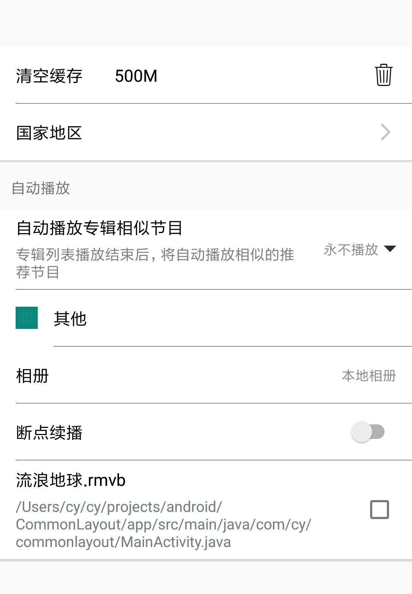

<!---->
<div align=center></div>

# 使用

## 1、布局

```
    <com.cy.settings.SettingsView
        android:id="@+id/mSettingView"
        android:layout_width="match_parent"
        android:layout_height="wrap_content"/>
```
## 2、java代码中

```
SettingsView mSettingView;

        mSettingView=findViewById(R.id.mSettingView);
        mSettingView.setAdapter(new SettingsAdapter(this));        
```

adapter

```
public class SettingsAdapter extends DefaultSettingAdapter {


    public SettingsAdapter(Activity activity) {
        super(activity);
    }

    @Override
    public List<IGroupData> getSettingsData() {
        List<IGroupData> data = new ArrayList<>();
        List<String> netConditions=new ArrayList<>();
        netConditions.add("仅Wi-Fi网络");
        netConditions.add("总是自动播放");
        netConditions.add("永不播放");

        IGroupData groupData = new DefaultGroupData();
        groupData.addSubItem(DefaultSubItemData.create().setTitle("清空缓存")
                .setTitleValue("500M").setDrawableRight(R.drawable.ic_delete))
                .addSubItem(DefaultSubItemData.create().setTitle("国家地区").setShowArrow(true));
        data.add(groupData);

        IGroupData groupData2 = new DefaultGroupData();
        groupData2.setGroupTitle("自动播放")
                .addSubItem(DefaultSubItemData.create()
                        .setTitle("自动播放专辑相似节目")
                        .setContent("专辑列表播放结束后，将自动播放相似的推荐节目")
                        .setShowSpinner("仅Wi-Fi网络",netConditions))

                .addSubItem(DefaultSubItemData.create().setTitle("其他")
                        .setDrawableLeft(R.drawable.ic_launcher_background))

                .addSubItem(DefaultSubItemData.create().setTitle("相册")
                .setSubTitle("本地相册"))
                .addSubItem(DefaultSubItemData.create()
                        .setTitle("断点续播")
                        .setShowSwitch(true))
                .addSubItem(DefaultSubItemData.create().setTitle("流浪地球.rmvb")
                .setContent("/Users/cy/cy/projects/android/CommonLayout/app/src/main/java/com/cy/commonlayout/MainActivity.java")
                        .setShowCheckbox(true));
        data.add(groupData2);

        return data;
    }


    @Override
    public void bindViewMore(int position, View itemView,
                         IGroupData groupData, ISubItemData subItemData) {

        if (((DefaultSubItemData) subItemData).getTitle().equals("支付")){
            itemView.setOnClickListener(new View.OnClickListener() {
                @Override
                public void onClick(View v) {
                    Toast.makeText(mActivity,"支付中...",Toast.LENGTH_SHORT).show();
                }
            });
        }
    }
}
```